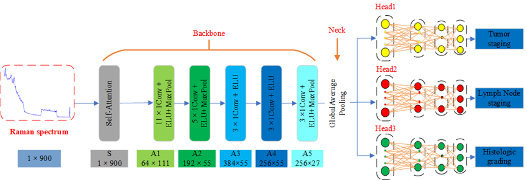
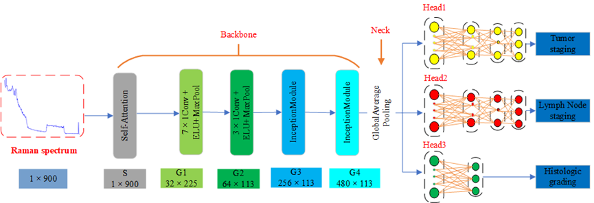
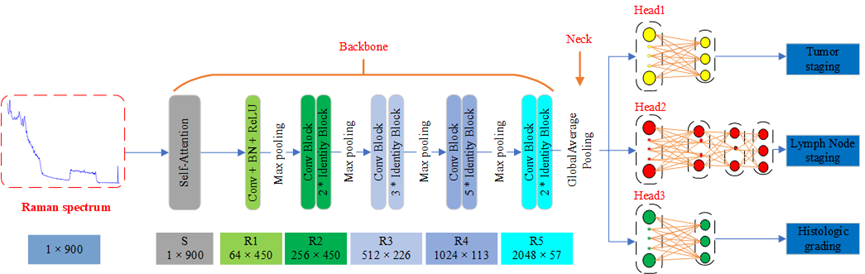
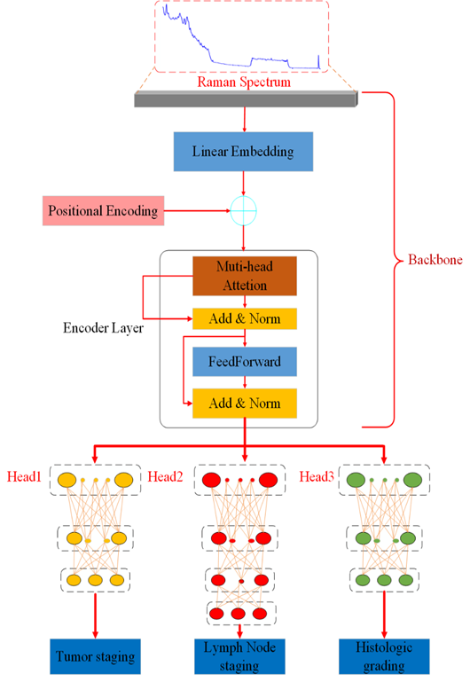
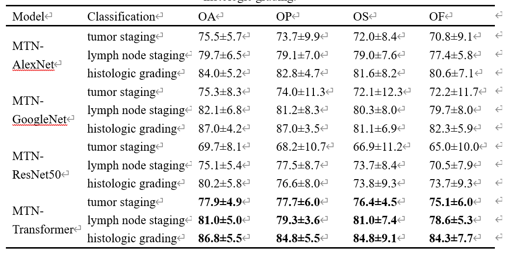
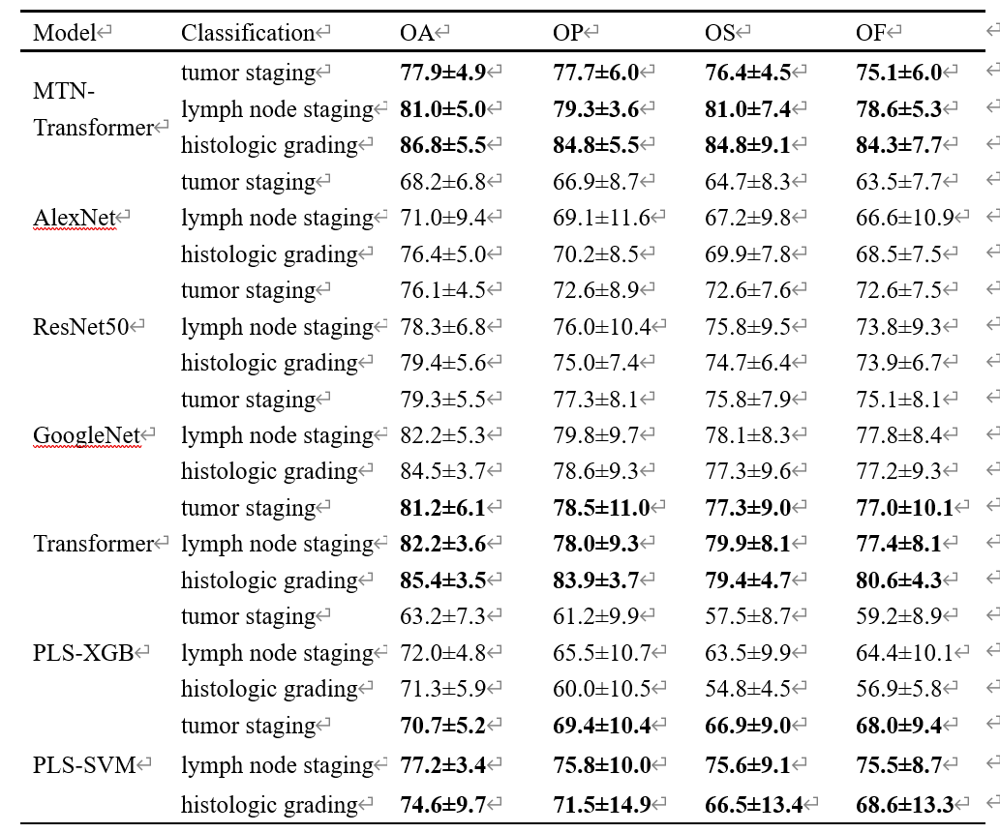

# MultiTask-OralRamanSystem
## Introduction

MultiTask-OralRamanSystem包含了四种多任务口腔癌智能诊断模型。该研究已发表在Elsevier的《Journal of Molecular Structure》杂志上。
本研究旨在改进AlexNet，GoogleNet，ResNet50以及Transformer等四个经典的神经网络模型来实现多任务分类，以准确诊断肿瘤患者的TNM分期和病理分类。
该模型能够提取共享拉曼光谱特征，同时实现T分期、N分期和病理分型的多任务诊断，从而为癌症患者的个体化治疗提供准确的诊断信息。

## Models
在我们的模型中，我们将模型修改为三个组件:Backbone、Neck和Head。Backbone执行特征提取，Neck执行全局池化，Head实现多任务分类。
backbone、neck和head组件在我们的分类器模块中分别实现，四个经典的网络模型图如下所示。

MTN-AlexNet network model:

MTN-GoogleNet network model:

MTN-ResNet50 network model:

MTN-Transformer network model:

### Backbone
Backbone includes AlexNet,GoogleNet, ResNet50 and Transformer, and users load the corresponding models through configuration files

Supported backbone network

- [x] [AlexNet](https://github.com/ISCLab-Bistu/MultiTask-OralRamanSystem/tree/main/models/backbones/alexnet.py)
- [x] [GoogleNet](https://github.com/ISCLab-Bistu/MultiTask-OralRamanSystem/tree/main/models/backbones/googlenet.py)
- [x] [ResNet50](https://github.com/ISCLab-Bistu/MultiTask-OralRamanSystem/tree/main/models/backbones/resnet50.py)
- [x] [Transformer](https://github.com/ISCLab-Bistu/MultiTask-OralRamanSystem/tree/main/models/backbones/transformer.py)

### Neck
Neck is mainly Global Average Pooling.

Neck network of support

- [x] [Global Average Pooling](https://github.com/LLY-Bistu/MultiRamanSystem/tree/main/models/necks/gap.py)

### Head
MultiTaskLinearClsHead is mainly used to implement multitask classification in Head. Meanwhile, the corresponding Loss is integrated in the Head.

Supported classification headers

- [x] [ClsHead](https://github.com/LLY-Bistu/MultiRamanSystem/tree/main/models/heads/cls_head.py)
- [x] [MultiTaskLinearClsHead](https://github.com/LLY-Bistu/MultiRamanSystem/tree/main/models/heads/multi_task_linear_head.py)

## Result
The corresponding results of the modified multi-output network model based on MTN-AlexNet,MTN-GoogleNet,MTN-ResNet50 and MTN-Transformer are shown in the following figure:

Table 1: OA, OP, OS and OF of 7-fold cross-validation and standard deviation of four multi-task network models on classification tasks involving tumor staging, lymph node staging and histologic grading.

Table 2: OA, OP, OS and OF of MTN-Transformer, AlexNet, ResNet50, GoogleNet, Transformer and machine learning methods on classification tasks including tumor staging, lymph node staging and histologic grading

